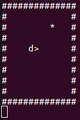

# Snake

This project is popular snake game. Some advanced C programming concepts like memory management are exercised in this project.

## Test
To run unit tests:  
`make run-unit-tests`  

To run integration test:  
`make run-integration-tests`  

## Execute
To run it interactively:  
`make interactive-snake`  
` ./interactive-snake`

